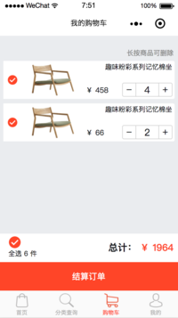

# panda-chat-room
小程序版 websocket 聊天室。 从服务器到小程序客户端配置基础教程。

在本教程内我们将在小程序内实现一个基本的 websocket 聊天室， 计划实现以下功能：

1. 微信用户登录「 小程序 session 管理 」☑️
1. 用户间文本交流 「 websocket 实现 」☑️
1. 用户间发送图片等富媒体信息 「 文件的储存及相关逻辑 」☑️
1. 其它好玩儿的东西




## 此分支为小程序端基础配置教程
查看服务器端配置可以切换到 server 分支

我在服务器端环境搭建及配置主要参考腾讯云实验 [基于 CentOS 搭建微信小程序服务](https://cloud.tencent.com/developer/labs/lab/10004)

``git checkout server``

我们在此先要理解小程序端为何无法实现 session， 以及如何在小程序实现 websocket 连接。

小程序并非嵌套在微信内的 html5 网页， 它并不是从 url 访问到的。 我们只能自己实现类似会话的东西， 好在官方已经提供了相应的套件来实现 session。 即 [wafer-client-sdk](https://github.com/tencentyun/wafer-client-sdk) 和 node 中间件 [wafer-node-session](https://github.com/tencentyun/wafer-node-session), 我们依照文档就能简单地实现 session。

在服务器端我们使用了 ws 包来实现 websocket。 没有使用 socket.io 的原因是 socket.io 需要客户端有额外的脚本才能实现通信。


在小程序端我们也引入 wafer-client-sdk 套件使服务器可以获取 session。

主要逻辑分为几个简单函数， 当然你需要先配置请求的服务器域名和小程序账号密码。

````js
// 引入 session 套件， 里面封装了 wx.login， wx.getUserInfo 等操作
const wafer = require('../../vendors/wafer-client-sdk/index')

// 用于登录使服务器获得 session， 然后服务器返回的 session 里就会包含用户信息了， 用来在 websocket 里返回发信息用户的头像 url
function login(){
  .....
}

// 用于有新信息时更新数据， msg 指信息， ad 指 websocket 传回的信息 id， 用于 scroll-into-view 滚动
pushMsg(msg, ad) {
  .....
}

// 用于监听 websocket 连接
listen(){
  .....
}

//  用于小程序发送 websocket 信息
send(){
  .....
}
````

基本就是这些， 关于 websocket 通信过程是这样的：

1. 客户端发送信息给服务器 m1
1. 服务器收到信息后根据条件返回给客户端 m2
1. 每个客户端收到 m2 后更新视图

当然最开始是要与服务器端 websocket 连接的， 只有每个连接了的客户端才可以交流信息。

## 小程序 session 解析

对于 session 的实现我们在服务器端使用了 wafer-node-seesion 即为连接提供 session 能力。 在小程序处我们使用了 wafer-client-sdk， 这里面封装了 wx.request、 wx.login 等逻辑， 实现了小程序端的用户登录、session 设置。

关于小程序端的 session 获取问题主要有如下几个步骤

1. wx.login 获取 code
1. wx.request 发送 code 给自己的服务器
1. 服务器收到 code 配合 appId 和 appSecret 发送给微信服务器换取 openId 和 sessionKey
1. wx.getUserInfo 会得到 rawData、signature、encryptedData、 iv， 我们需要把它们发送到自己服务器。 我们构建自己的 signature2 = sha1(sessionKey + rawData) , 比对 signature 和 signature2 就完成了数据校验
1. 服务端通过 aes-128-cbc 算法对称解密  encryptedData 和 iv 然后得到 userInfo 这次得到的 userInfo 里还包含 openId 等信息 「如果在微信开放平台绑定小程序就会得到 unionId」
1. 服务端构建 req.session 对象，里面包含 id、 userInfo、 sessionKey「小程序传到服务器的」、skey 「服务器自己根据sessionKey + appId + appSecret 生成， 有过期时间」。 而我们自己生成的 skey 是有设置过期时间的， 但小程序端的 session 也有自己的过期时间 「应该是微信按使用小程序的频率来动态设置过期时间的。 wafer 会自动调用 wx.checkSession 检查是否过期， 过期了就 wx.login」。

在我们的 demo 中就出现了服务器 session 已经过期而本地 session 还没过期的情况。 而 websocket 每次发送信息都需要从 req.session 内获取用户头像， 所以会导致 websocket 连接失败。 但是在小程序端 session 未过期，即在服务器端的 sessionKey 和小程序的 sessionKey 不一致了 「客户端 sessionKey 还在而服务器的 sessionKey 已经过期销毁」， 导致比对失败。 那怎么办呢？ 重新请求呗！ 但是因为 wafer 封装了 session 管理 「小程序端 session 过期后才会重新请求」， 因为小程序内 session 缓存的缘故， 小程序并没有重新发送信息给自己的服务器进而生成新的 sessionKey， 所以我们在每一次 wx.sendSocketMessage 发信息的时候都要检查服务器端的 session 情况， 这里需要做简单的判断「websocket 信息有错误就清除本地 session」让小程序重新请求服务器。

## websocket 信息发送及其它信息通信逻辑

既然要发送信息「即产生数据」， 那么这些信息都储存在哪里呢？ 在发送文本信息时， 服务器端收到数据后只做简单地处理便返回给小程序， 这时的数据应该是储存在服务器内存中。 因为 websocket 在收到请求后简单处理了字符串信息直接返回给小程序， 那我们发送其它富媒体信息时，也可以以二进制的方式发送给 websocket 服务器， 然后重新返回给客户端 「即 websocket 只做文件中转」，相关实现 [websocket-stream](https://www.npmjs.com/package/websocket-stream) 。 貌似看起来很复杂，在这里我使用了国内的 paas 服务商  [leanCloud](https://leancloud.cn/) 的储存服务 「即小程序端把发送的文件储存在云端，返回一个文件地址」，然后我们把这个文件信息进行标注「即只发送文件的 url 信息， 小程序端判断请求是否是文件进而显示」。


## 注意事项

如果你想依此来构建自己的聊天小程序需要修改小程序端和服务器端的各项配置「小程序安全域名信息、appId、leanCloud 的 appId 和 appKey 以及 leanCloud 文件储存需要的安全域名」

此 demo 中的所有配置信息有可能随时失效

关于服务器端的配置大家可以参考腾讯云实验室 [基于 CentOS 搭建微信小程序服务](https://cloud.tencent.com/developer/labs/lab/10004), 基本无误， 但在配置 wss 时可能出现 ``shakehand error`` 消息， 是因为 nginx 设置 websocket 的配置文件不对。 因为 websocket 监听的是 http 端口， 所以我们应该在 ``nginx.conf`` 文件里开启 websocket 「具体参考 server 分支下的 ``nginx.conf`` 配置」
